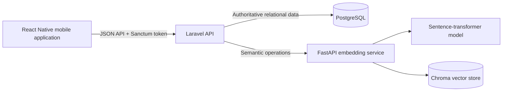

# Guised Up — Real Connections Feed

## Full Video Walkthrough

[](docs/guised-up-full-walkthrough.mp4)

**[▶ Watch the complete 7-minute walkthrough](docs/guised-up-full-walkthrough.mp4)** — architecture, protected APIs, feed ranking, the working mobile experience, semantic search, SQL, automated tests, trade-offs, and local setup.

## Overview

Guised Up is a full-stack take-home assessment that implements a personalized social feed without using platform-wide popularity as a ranking signal. It ranks posts using authenticity, relationship depth, semantic similarity, and time decay, and it supports natural-language post discovery through semantic search.

## What Was Built

- Laravel REST API with Laravel Sanctum authentication
- PostgreSQL relational database and deterministic seed data
- Explainable personalized feed-ranking engine
- Python FastAPI embedding service
- Sentence-transformer embeddings using `sentence-transformers/all-MiniLM-L6-v2`
- Persistent Chroma vector store
- Expo React Native Feed Screen
- Four raw PostgreSQL challenge queries
- Automated Laravel, Python, and mobile tests
- [Technical Solution Document](docs/TSD.md)
- [Complete narrated video walkthrough](docs/guised-up-full-walkthrough.mp4)
- [Video walkthrough recording guide](docs/VIDEO_WALKTHROUGH.md)

## Candidate Background and Ownership

Laravel and PHP are my primary areas of professional expertise. I have working familiarity with React Native, Expo, Python, FastAPI, embeddings, and vector databases, but I do not present myself as a specialist in those ecosystems.

For this assessment, I designed the implementation plan, selected the architecture, directed the AI-assisted workflow, reviewed each generated change, corrected scope and documentation issues, validated the APIs and integrations, and ran the complete application locally.

I can explain the data flow, ranking logic, Laravel-to-FastAPI integration, vector-search behavior, failure handling, testing strategy, and architectural trade-offs. The result demonstrates my ability to understand a product requirement, use AI tools effectively, review and integrate work across multiple technologies, validate correctness, and deliver a functioning application.

## AI-Assisted Development Workflow

ChatGPT supported assignment analysis, architecture clarification, decomposition into focused phases, and prompt preparation. OpenAI Codex Goal Mode was then used to inspect the repository, implement code, run tests, validate integrations, and update documentation.

The work was completed in eight primary implementation phases:

1. Technical Solution Document
2. Monorepo scaffolding
3. Laravel database and authentication foundation
4. Python embeddings and Chroma service
5. Laravel APIs and feed ranking
6. React Native Feed Screen
7. SQL challenge and documentation
8. Final validation and submission preparation

A small number of additional corrective prompts addressed formatting, documentation, and repository-visibility decisions. I reviewed every phase before moving to the next and remained responsible for scope, architecture and product decisions, corrections, validation, and final delivery. Generated output was verified through automated tests, real service startup, authenticated API smoke tests, SQL execution, TypeScript validation, and Android and iOS Expo exports rather than accepted without review.

## Architecture



The mobile application communicates only with Laravel. Laravel is the main backend and owns authentication, API contracts, business logic, and ranking. PostgreSQL is authoritative for users, posts, and interactions. FastAPI provides embedding and semantic-retrieval operations, while Chroma is a replaceable vector index rather than the primary database. See the [Technical Solution Document](docs/TSD.md) for the complete architecture and data flows.

## Feed Ranking

```text
score =
0.25 × authenticity
+ 0.30 × relationship depth
+ 0.30 × semantic similarity
+ 0.15 × time decay
```

- **Authenticity** is a deterministic text-based authenticity heuristic; it does not perform visual image-authenticity detection.
- **Relationship depth** uses only the authenticated user's own interactions with each author. The interaction weights are `view = 1`, `reaction = 3`, and `reply = 5`.
- **Semantic similarity** uses embeddings from posts with which the user has interacted.
- **Time decay** is `exp(-age_in_hours / 72)`.
- Platform-wide popularity is not used.

## Monorepo Structure

```text
apps/
  api/                  Laravel API, database migrations, seeders, and tests
  mobile/               Expo React Native Feed Screen and Jest tests
services/
  embeddings/           FastAPI, sentence-transformer, Chroma, and pytest tests
docs/                   Technical design and video walkthrough guide
sql/                    PostgreSQL challenge queries
```

## Technology Stack

| Area | Technology | Repository or tested version |
|---|---|---|
| Main backend | Laravel | 13.19.0 |
| Runtime | PHP | 8.4.23 |
| Relational database | PostgreSQL | 18.4 tested |
| API authentication | Laravel Sanctum | 4.3.2 |
| Mobile framework | Expo | 57.0.4 |
| Mobile UI | React Native | 0.86.0 |
| Mobile language | TypeScript | 6.0.3 |
| Semantic service | Python / FastAPI | Python 3.14.4 / FastAPI 0.139.0 |
| Embeddings | sentence-transformers | 5.2.3 |
| Embedding model | `sentence-transformers/all-MiniLM-L6-v2` | CPU inference |
| Vector store | Chroma | 1.4.1 |
| Laravel tests | PHPUnit | 12.5.31 |
| Python tests | pytest | 9.0.2 |
| Mobile tests | Jest via jest-expo | 57.0.1 |

## Prerequisites

The project was validated locally with:

- Git 2.50
- PHP 8.4
- Composer 2
- PostgreSQL 18 and `psql`; a reasonably compatible modern PostgreSQL version should also work
- Node.js 24
- npm 11
- Python 3.14

The project was validated with Python 3.14. If dependency installation fails on another environment, Python 3.12 or 3.13 is a suitable fallback for the listed ML dependencies.

Xcode or Android Studio is required only when running an iOS simulator or Android emulator. A supported physical Expo environment can be used instead.

## Fresh Clone Setup

Unless a step opens a long-running process, each command block starts from the repository root. Long-running services should stay open in their own terminals.

### Step 1 — Clone

Use either SSH:

```bash
git clone git@github.com:vipertecpro/guised-up-assessment-vipul-walia.git
cd guised-up-assessment-vipul-walia
```

or HTTPS for the public repository:

```bash
git clone https://github.com/vipertecpro/guised-up-assessment-vipul-walia.git
cd guised-up-assessment-vipul-walia
```

Only one clone command is needed.

### Step 2 — Create the PostgreSQL database

Use the local PostgreSQL role configured for your development environment:

```bash
createdb guised_up
```

Alternatively, run this statement in `psql` while connected through a role allowed to create databases:

```sql
CREATE DATABASE guised_up;
```

The PostgreSQL username and password depend on the local installation; the project does not assume that the role is named `postgres`.

### Step 3 — Configure Laravel

From the repository root:

```bash
cd apps/api
composer install
cp .env.example .env
php artisan key:generate
```

Update these values in `apps/api/.env`:

```dotenv
DB_CONNECTION=pgsql
DB_HOST=127.0.0.1
DB_PORT=5432
DB_DATABASE=guised_up
DB_USERNAME=their_local_postgres_role
DB_PASSWORD=their_local_postgres_password

EMBEDDINGS_SERVICE_URL=http://127.0.0.1:8001
```

If the local PostgreSQL role has no password, leave `DB_PASSWORD` empty. Then create the schema and deterministic data:

```bash
php artisan migrate:fresh --seed
```

The seed creates 3 users, 15 posts, and 18 interactions. `migrate:fresh` drops existing tables in the configured database, so use a dedicated local `guised_up` database.

### Step 4 — Configure the Python embedding service

In a new terminal from the repository root:

```bash
cd services/embeddings
python3 -m venv .venv
source .venv/bin/activate
python -m pip install --upgrade pip
pip install -r requirements.txt
cp .env.example .env
```

On Windows, activate the environment with `.venv\Scripts\activate` instead.

The normal provider is `sentence_transformer`, the model is `sentence-transformers/all-MiniLM-L6-v2`, and the Chroma collection is `posts`. Chroma persists under local ignored storage. Start FastAPI:

```bash
uvicorn app.main:app --host 127.0.0.1 --port 8001
```

Keep this terminal running. The first transformer-backed operation may download the model.

### Step 5 — Index the seeded posts

In a second terminal from the repository root:

```bash
cd apps/api
php artisan app:index-posts
```

For a fresh seed with FastAPI available, the command reports:

```text
Processed: 15
Succeeded: 15
Failed: 0
```

### Step 6 — Generate a local Sanctum token

Continue in `apps/api`:

```bash
php artisan app:issue-demo-token vipul@example.com
```

The plaintext token is displayed once. Copy it for the mobile environment and never commit it. Running the command again replaces the previous `assessment-mobile` token for that user.

### Step 7 — Start Laravel

Continue in `apps/api`:

```bash
php artisan serve --host=127.0.0.1 --port=8000
```

Keep this terminal running.

### Step 8 — Configure the mobile application

In another terminal from the repository root:

```bash
cd apps/mobile
npm install
cp .env.example .env
```

Set the API URL and the token generated by Laravel:

```dotenv
EXPO_PUBLIC_API_BASE_URL=http://127.0.0.1:8000/api
EXPO_PUBLIC_API_TOKEN=the-token-generated-by-laravel
```

Use the URL reachable from the selected target:

- iOS simulator: `http://127.0.0.1:8000/api`
- Android emulator: `http://10.0.2.2:8000/api`
- Physical device: the development computer's LAN IP, such as `http://192.168.x.x:8000/api`

For a physical device, Laravel may need to listen on the LAN:

```bash
php artisan serve --host=0.0.0.0 --port=8000
```

Run that command from `apps/api`. `EXPO_PUBLIC_*` values are bundled into the application; this token workflow is for local assessment demonstration only, not production authentication.

### Step 9 — Start Expo

Continue in `apps/mobile`:

```bash
npm start
```

Press `i` for iOS, press `a` for Android, or scan the QR code for a supported physical Expo environment.

## Service Startup Order

For a complete local demonstration, use this operational order:

1. PostgreSQL
2. FastAPI embedding service
3. Laravel migrations and seed
4. Post indexing
5. Demo token generation
6. Laravel server
7. Expo mobile application

Laravel migrations do not require FastAPI and may be completed before it starts. Post indexing and semantic features do require FastAPI.

## Demo Accounts

The deterministic local seed creates:

- `vipul@example.com`
- `maya@example.com`
- `arjun@example.com`

All use the development-only password `password`. The mobile demonstration uses a generated Sanctum token and has no login screen because the assignment required only the Feed Screen.

## API Endpoints

| Method | Endpoint | Purpose | Authentication |
|---|---|---|---|
| `GET` | `/api/user` | Return the authenticated user | Required |
| `POST` | `/api/posts` | Create and attempt to index a post | Required |
| `GET` | `/api/feed?page=1` | Return the personalized paginated feed | Required |
| `GET` | `/api/search?q=...` | Perform natural-language semantic search | Required |
| `POST` | `/api/interactions` | Record a view, reaction, or reply | Required |

## Example API Requests

With Laravel running, set the local token once:

```bash
TOKEN="replace-with-local-token"
```

Request the feed and search by meaning:

```bash
curl -H "Accept: application/json" \
  -H "Authorization: Bearer $TOKEN" \
  "http://127.0.0.1:8000/api/feed?page=1"

curl -G -H "Accept: application/json" \
  -H "Authorization: Bearer $TOKEN" \
  --data-urlencode "q=quiet moments outdoors" \
  "http://127.0.0.1:8000/api/search"
```

Record an interaction and create a post:

```bash
curl -X POST -H "Accept: application/json" \
  -H "Authorization: Bearer $TOKEN" \
  -H "Content-Type: application/json" \
  -d '{"post_id": 2, "type": "reaction"}' \
  "http://127.0.0.1:8000/api/interactions"

curl -X POST -H "Accept: application/json" \
  -H "Authorization: Bearer $TOKEN" \
  -H "Content-Type: application/json" \
  -d '{"text": "A quiet walk after work helped me reset."}' \
  "http://127.0.0.1:8000/api/posts"
```

Successful assignment endpoints return JSON under `data`; feed responses also include pagination and semantic-availability metadata. See the [TSD API design](docs/TSD.md#10-api-design) for response shapes and validation rules.

## Failure Behaviour

- PostgreSQL post creation succeeds even when vector indexing fails.
- Failed posts receive `embedding_status=failed`.
- `php artisan app:index-posts` retries pending and failed records; `--force` re-indexes all posts.
- Search returns HTTP `503` when semantic infrastructure is unavailable.
- The feed remains available using authenticity, relationships, and recency, with semantic similarity set to zero.
- Chroma IDs that do not resolve to authoritative PostgreSQL posts are ignored.

## Running Tests

### Laravel

From the repository root:

```bash
cd apps/api
composer validate
php artisan test
vendor/bin/pint --test
```

### Python

From the repository root:

```bash
cd services/embeddings
source .venv/bin/activate
pytest
```

### Mobile

From the repository root:

```bash
cd apps/mobile
npm test
npm run typecheck
```

### Optional Expo bundle validation

These exports validate native bundling but are not part of normal setup:

```bash
cd apps/mobile
npx expo export --platform android --output-dir /tmp/guised-up-android
npx expo export --platform ios --output-dir /tmp/guised-up-ios
```

### SQL challenge

From the repository root:

```bash
psql -d guised_up -f sql/queries.sql
```

Pass the appropriate role, host, and port options when local defaults differ. D2 contains a replaceable example `user_id` parameter.

## Current Validation

The last local verification produced:

- Laravel: 22 tests, 126 assertions
- Python: 7 tests
- Mobile: 9 tests
- TypeScript: passed
- Android Expo export: passed
- iOS Expo export: passed
- Seed data: 3 users, 15 posts, 18 interactions, and 15 ready embeddings after indexing
- PostgreSQL queries D1 through D4: executed successfully

These are local validation results and should be rerun after cloning.

## Documentation Links

- [Technical Solution Document](docs/TSD.md)
- [Complete narrated video walkthrough](docs/guised-up-full-walkthrough.mp4)
- [Video walkthrough recording guide](docs/VIDEO_WALKTHROUGH.md)
- [PostgreSQL challenge queries](sql/queries.sql)
- [Laravel API guide](apps/api/README.md)
- [Mobile application guide](apps/mobile/README.md)
- [Embedding-service guide](services/embeddings/README.md)

## Known Limitations and Trade-offs

- The authenticity score uses deterministic text heuristics, not visual image analysis.
- Embedding generation is synchronous for assessment simplicity.
- PostgreSQL and Chroma do not share a transaction.
- Chroma is practical for local reproducibility; `pgvector` could reduce infrastructure in a Laravel-heavy production stack.
- The Expo token setup is only for local demonstration.
- The hash provider is a deterministic lexical fallback, not transformer-level semantic understanding.
- Laravel is my primary professional stack; Python/FastAPI and React Native/Expo are areas of working familiarity rather than specialist expertise.

## Repository and Confidentiality Note

This repository is public for direct recruiter review. The original confidential assignment PDF is not included. Secrets, tokens, local credentials, environment files, vector data, generated dependencies, and local build output are excluded. The code is shared for assessment and portfolio review.
