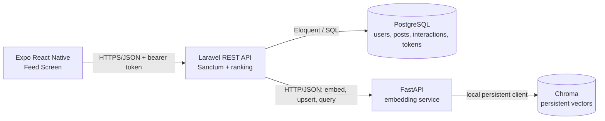

# Technical Solution Document

## 1. Executive Summary

This assessment will deliver a deliberately small monorepo with three application processes: an Expo React Native feed screen, a Laravel REST API, and a Python FastAPI embedding service. Laravel owns authentication and relational data in PostgreSQL. The Python service owns embedding generation and persistent vector storage in Chroma. The API supports post creation, a personalized paginated feed, natural-language search, and interaction logging without introducing infrastructure that the assignment does not require.

Authenticity is an explainable text-based approximation. The available input contains post text and an optional image URL, so the system will not claim to detect visual filters, retouching, or image polish. Production-grade visual authenticity would require image metadata, direct image access, or a vision model.

## 2. Product Understanding

The product is a focused proof of concept for ranking a social feed around authentic expression and meaningful relationships while supporting semantic discovery. A user can create a text post with an optional remote image URL, browse a ranked feed, search posts by meaning rather than exact keywords, and generate implicit preference data through views, reactions, and replies.

The assessment tests system design, ranking choices, API quality, data modeling, SQL fluency, a single mobile feed experience, and reproducible local setup. It is not a complete social network.

## 3. Goals and Non-Goals

### Goals

- Provide the four required authenticated API endpoints.
- Persist users, posts, interactions, and Sanctum tokens in PostgreSQL.
- Generate post and query embeddings through FastAPI and persist vectors in Chroma.
- Rank feeds using authenticity, relationship depth, semantic relevance, and time decay.
- Render one Expo React Native TypeScript feed screen.
- Provide raw PostgreSQL challenge queries and reproducible local instructions in later phases.
- Keep decisions explainable and the local system easy to run.

### Non-Goals

- Image upload, image processing, or claims of visual authenticity detection.
- Follow/social-graph modules, comments/replies content, messaging, notifications, or additional mobile screens.
- Admin panels, recommendation-model training, moderation workflows, or production analytics.
- Redis, queues, WebSockets, event sourcing, Kubernetes, Docker, cloud infrastructure, or additional microservices.

## 4. Assumptions

- All API endpoints require a valid local Sanctum bearer token.
- Seeders will create at least two users and print or otherwise expose local-only tokens through a documented command; no login screen or authentication endpoint is needed.
- An interaction of type `reply` records that a reply occurred; reply body storage is outside scope.
- `image_url` is a reference to an already-hosted image, not an upload.
- Post text is the only content embedded in Phase 1's selected design.
- Chroma runs persistently inside the Python service process using a local data directory; it is not a fourth network service.
- Feed candidates exclude the requesting user's own posts and use a bounded recent candidate set so ranking remains understandable for the take-home.
- All timestamps are stored in UTC and returned as ISO 8601 strings.

## 5. Monorepo Structure

```text
guised-up-assessment-vipul-walia/
├── apps/
│   ├── api/                    # Laravel API, migrations, seeders, and tests
│   └── mobile/                 # Expo React Native TypeScript feed screen
├── services/
│   └── embeddings/             # FastAPI service, Chroma persistence, and tests
├── docs/
│   └── TSD.md                  # This document
├── sql/
│   └── queries.sql             # SQL challenge, added in a later phase
└── README.md
```

Only `README.md` and this document are created in Phase 1.

## 6. System Architecture



Laravel is the public application boundary and source of truth for post and interaction records. The Python service has one responsibility: embedding and vector operations. Chroma stores vector documents keyed to PostgreSQL post IDs; it does not replace relational storage.

## 7. Request and Data Flows

### Post creation and embedding

1. The mobile client sends authenticated `POST /api/posts` with `text` and optional `image_url`.
2. Laravel validates the request, calculates the text-based authenticity score, and inserts the post with `embedding_status = pending`.
3. After the database insert commits, Laravel synchronously asks FastAPI to embed the text and upsert the vector under `post:{id}` with `post_id` metadata.
4. Laravel stores that identifier in `vector_document_id` and marks the post `ready`.
5. If embedding fails or times out, the post remains usable with `embedding_status = failed`; the API returns the created post honestly rather than pretending semantic indexing succeeded. A documented local retry command may re-index failed posts in a later phase.

### Personalized feed retrieval

1. The client requests authenticated `GET /api/feed?page=N`.
2. Laravel loads a bounded set of recent posts and interaction aggregates from PostgreSQL.
3. When the user has interaction history, Laravel asks FastAPI for semantic similarity against the user's derived interest vector.
4. Laravel normalizes the four ranking signals, computes one score per candidate, sorts by score and then recency, and paginates the ranked result at 20 posts per page.
5. If vector ranking is unavailable, Laravel uses the remaining signals with re-normalized weights and returns a valid feed.

### Semantic search

1. The client sends authenticated `GET /api/search?q={query}`.
2. Laravel validates and forwards the query to FastAPI.
3. FastAPI embeds the query, asks Chroma for nearest post vectors, and returns IDs with cosine similarity.
4. Laravel fetches the corresponding PostgreSQL posts, preserves relevance order, excludes unavailable records, and returns at most 10 results.
5. If the embedding service is unavailable, Laravel returns `503` with the shared error shape; lexical search is not silently substituted for semantic search.

### Interaction logging

1. The client sends authenticated `POST /api/interactions` with `post_id` and `type`.
2. Laravel validates the type and target post, then inserts an interaction owned by the authenticated user.
3. The new row contributes to later relationship and interest-vector calculations. Repeated views are allowed because they represent separate events.

## 8. Database Schema

PostgreSQL is authoritative for application data. IDs use `bigint` identity columns, timestamps use timezone-aware values, and foreign keys enforce ownership.

### `users`

| Field | Type | Rules |
|---|---|---|
| `id` | `bigint` | Primary key |
| `name` | `varchar(255)` | Required |
| `email` | `varchar(255)` | Required, unique |
| `email_verified_at` | `timestamptz` | Nullable |
| `password` | `varchar(255)` | Required, hashed; seeded locally |
| `created_at`, `updated_at` | `timestamptz` | Required |

### `posts`

| Field | Type | Rules |
|---|---|---|
| `id` | `bigint` | Primary key |
| `user_id` | `bigint` | FK to `users.id`, cascade on delete |
| `text` | `text` | Required, non-blank, maximum 5,000 characters at API boundary |
| `image_url` | `varchar(2048)` | Nullable, valid HTTP(S) URL |
| `authenticity_score` | `numeric(5,4)` | Required, check between `0` and `1` |
| `vector_document_id` | `varchar(255)` | Nullable, unique when present |
| `embedding_status` | `varchar(20)` | Required; check in `pending`, `ready`, `failed` |
| `created_at`, `updated_at` | `timestamptz` | Required |

Indexes: `(created_at DESC, id DESC)` for recent feed candidates and stable pagination; `(user_id, created_at DESC)` for author post queries; `(embedding_status, id)` for re-indexing and vector reconciliation.

### `interactions`

| Field | Type | Rules |
|---|---|---|
| `id` | `bigint` | Primary key |
| `user_id` | `bigint` | FK to `users.id`, cascade on delete |
| `post_id` | `bigint` | FK to `posts.id`, cascade on delete |
| `type` | `varchar(20)` | Check in `view`, `reaction`, `reply` |
| `created_at`, `updated_at` | `timestamptz` | Required |

Indexes: `(user_id, created_at DESC)` for user-interest history; `(user_id, post_id)` for per-user/post analysis; `(post_id, type)` for interaction aggregation; `(post_id, created_at DESC)` for post activity and SQL challenge queries. No uniqueness constraint is added because repeated events, especially views, are meaningful.

### `personal_access_tokens`

Laravel Sanctum's standard polymorphic token table is used: `id`, `tokenable_type`, `tokenable_id`, `name`, unique hashed `token`, nullable `abilities`, nullable `last_used_at`, nullable `expires_at`, and timestamps. The `(tokenable_type, tokenable_id)` index supports token ownership lookups; the unique token index supports authentication.

### Relationships

- A user has many posts and interactions.
- A post belongs to one author and has many interactions.
- A user has many Sanctum personal access tokens through the polymorphic token relation.

A separate follows system is unnecessary because relationship depth can be inferred from the requesting user's weighted interactions with each post author. This directly serves the required ranking signal without expanding the assessment into social-graph management.

## 9. Vector Embedding Design

### Why Chroma

Chroma provides persistent local vector storage, metadata filtering, and nearest-neighbor queries with little operational overhead. It suits a reproducible take-home better than adding vector extensions or managed infrastructure, while keeping vector concerns isolated in Python.

### Post storage and query embedding

FastAPI uses one documented sentence-embedding model for both posts and queries. On post creation it upserts a Chroma document with ID `post:{post_id}`, the post text, its vector, and `post_id` metadata. Using an idempotent ID makes retries safe. Search embeds the natural-language query with the same model and requests the nearest vectors, returning post IDs, distances, and normalized similarities.

### User-interest vector

Laravel loads the user's interacted-with post IDs and event types. FastAPI retrieves their vectors and calculates a weighted mean using `view = 1`, `reaction = 3`, and `reply = 5`, then L2-normalizes the result. Multiple interactions can increase influence, but each post's accumulated contribution is capped at `5` to prevent repeated views from dominating. The vector is calculated on demand for this small assessment rather than stored as another mutable artifact.

### Failure and fallback behavior

- Post creation succeeds relationally even when indexing fails, and exposes `embedding_status = failed`.
- Feed ranking omits semantic relevance when FastAPI or Chroma is unavailable and re-normalizes the available signal weights.
- Search returns `503 Service Unavailable` because returning lexical results would misrepresent the required semantic behavior.
- Chroma results whose posts no longer exist in PostgreSQL are ignored.
- Timeouts are short and explicit; errors are logged without exposing internals to the client.

### Production changes

A production system would index asynchronously, add durable retries and observability, version embedding models, rebuild collections safely, cache user-interest vectors, reconcile orphaned records, and consider PostgreSQL with `pgvector` or a managed vector database. Those changes are not implementation scope for this assessment.

## 10. API Design

### Authentication strategy

Every endpoint uses `auth:sanctum` and accepts `Authorization: Bearer <local-token>`. Seeders create at least two local users. A local-only Artisan command or clearly marked seeding output creates tokens for simulator testing. No login endpoint or mobile login screen is added.

All successful responses use a `data` key. Validation and service errors share a predictable error shape.

### `POST /api/posts`

Request:

```json
{
  "text": "I finally learned to make my grandmother's soup today.",
  "image_url": "https://example.test/images/soup.jpg"
}
```

Validation: `text` is required, a string, non-blank, and at most 5,000 characters. `image_url` is nullable, an HTTP(S) URL, and at most 2,048 characters.

Response: `201 Created`.

```json
{
  "data": {
    "id": 42,
    "user_id": 1,
    "text": "I finally learned to make my grandmother's soup today.",
    "image_url": "https://example.test/images/soup.jpg",
    "authenticity_score": 0.84,
    "embedding_status": "ready",
    "created_at": "2026-07-13T10:30:00Z"
  }
}
```

### `GET /api/feed?page=1`

Validation: `page` is optional and must be an integer of at least `1`. Page size is fixed at `20`.

Response: `200 OK`.

```json
{
  "data": [
    {
      "id": 42,
      "author": { "id": 2, "name": "Asha" },
      "text": "A quiet morning walk before work.",
      "image_url": null,
      "created_at": "2026-07-13T08:00:00Z"
    }
  ],
  "meta": {
    "current_page": 1,
    "per_page": 20,
    "last_page": 3,
    "total": 47,
    "from": 1,
    "to": 20
  },
  "links": {
    "first": "/api/feed?page=1",
    "last": "/api/feed?page=3",
    "prev": null,
    "next": "/api/feed?page=2"
  }
}
```

### `GET /api/search?q=quiet moments outdoors`

Validation: `q` is required, a non-blank string, and at most 500 characters. The result limit is fixed at `10`.

Response: `200 OK`; each result has the normal post representation plus a `similarity_score` from `0` to `1`.

```json
{
  "data": [
    {
      "id": 42,
      "author": { "id": 2, "name": "Asha" },
      "text": "A quiet morning walk before work.",
      "image_url": null,
      "similarity_score": 0.91,
      "created_at": "2026-07-13T08:00:00Z"
    }
  ]
}
```

### `POST /api/interactions`

Request:

```json
{
  "post_id": 42,
  "type": "reaction"
}
```

Validation: `post_id` is required and must reference an existing post; `type` is required and one of `view`, `reaction`, or `reply`.

Response: `201 Created`.

```json
{
  "data": {
    "id": 173,
    "user_id": 1,
    "post_id": 42,
    "type": "reaction",
    "created_at": "2026-07-13T10:35:00Z"
  }
}
```

### Status codes and errors

- `200` for successful reads.
- `201` for created posts and interactions.
- `401` for missing or invalid tokens.
- `404` for unavailable resources where applicable.
- `422` for validation failures.
- `503` when semantic search cannot reach its required vector capability.

```json
{
  "message": "The given data was invalid.",
  "errors": {
    "type": ["The selected type is invalid."]
  }
}
```

Non-validation failures use the same top-level `message` and may include a stable `code`, for example `EMBEDDING_SERVICE_UNAVAILABLE`, but never a stack trace.

## 11. Feed Ranking Algorithm

### Plain-English approach

The feed favors posts that look conversational and personal based on available text, authors with whom the user has meaningfully interacted, posts semantically close to the user's demonstrated interests, and recent posts. No signal is allowed to use a radically different numerical range. The score is explainable and deterministic, which is more appropriate here than an opaque learned model.

### Normalized signals

- `A`, authenticity: stored directly in `[0,1]`. Start from a neutral base and reward first-person/conversational language and reasonable lexical diversity; penalize excessive hashtags, URLs, repeated characters, all-caps text, and promotional phrasing. It is not a visual-quality score.
- `R`, relationship depth: sum weighted interactions by the current user across posts from the candidate's author, then normalize as `min(1, ln(1 + weighted_total) / ln(21))`.
- `S`, semantic relevance: cosine similarity mapped from `[-1,1]` to `[0,1]` using `(cosine + 1) / 2`, then clamped.
- `T`, time decay: `exp(-ln(2) * age_hours / 72)`, giving recency a 72-hour half-life and a value in `(0,1]`.

Interaction weights are `view = 1`, `reaction = 3`, and `reply = 5`. Replies indicate more investment than reactions, while views are useful but weak.

### Weighted score

```text
score = 0.25A + 0.30R + 0.30S + 0.15T
```

If semantic ranking is unavailable, remove `S` and divide the remaining weighted sum by `0.70`; the result stays normalized. Scores tie-break by `created_at DESC`, then `id DESC`.

### New users

For a user with no interactions, `R = 0` and no interest vector exists. The feed uses authenticity and time decay only, re-normalized across their combined weight, providing a useful recent feed without inventing preferences. As interactions accumulate, relationship and semantic signals enter naturally.

### Pseudocode

```text
function personalizedFeed(user, page):
    candidates = recentPosts(excludingAuthor=user.id, boundedLimit=500)
    history = interactionsFor(user.id)
    authorWeights = aggregateByPostAuthor(history, view=1, reaction=3, reply=5)
    interestVector = weightedMeanOfPostVectors(history, perPostCap=5)

    semanticScores = {}
    if interestVector exists and embeddingService is available:
        semanticScores = similarities(interestVector, candidates)

    ranked = []
    for post in candidates:
        A = clamp(post.authenticityScore, 0, 1)
        R = min(1, ln(1 + authorWeights[post.userId]) / ln(21))
        T = exp(-ln(2) * ageInHours(post.createdAt) / 72)

        if post.id exists in semanticScores:
            S = clamp((semanticScores[post.id] + 1) / 2, 0, 1)
            score = 0.25*A + 0.30*R + 0.30*S + 0.15*T
        else:
            score = (0.25*A + 0.30*R + 0.15*T) / 0.70

        ranked.append(post, score)

    sort ranked by score DESC, createdAt DESC, id DESC
    return paginateInMemory(ranked, page, perPage=20)
```

The bounded candidate set is an assessment trade-off. At production scale, candidate generation and ranking would move closer to indexed/vector queries rather than loading hundreds of records into application memory.

## 12. Natural-Language Search Design

Search treats the submitted sentence as semantic intent, not a set of exact terms. Laravel validates `q`, FastAPI generates an embedding with the same model used for posts, and Chroma returns nearest vectors by cosine distance. FastAPI converts distance into a documented normalized similarity, and Laravel joins vector IDs back to authoritative post records before returning the top 10.

The endpoint does not blend popularity or relationship signals because the requirement is relevance-focused semantic search. Empty queries are rejected, missing relational posts are skipped, and embedding-service failure produces a transparent `503` rather than a misleading substitute.

## 13. Security and Authentication

- Laravel Sanctum tokens are hashed in PostgreSQL and sent only through bearer authorization headers.
- Local tokens are development credentials, excluded from source control, and generated through seed output or a local-only command.
- Route middleware derives `user_id`; clients cannot submit another user's ID.
- Laravel validation bounds strings, restricts interaction types, validates foreign keys, and accepts only HTTP(S) image URLs.
- Eloquent/query bindings prevent SQL injection; raw SQL challenge queries will use parameters where inputs are represented.
- FastAPI is bound for local development and is not exposed to the mobile app. Laravel uses a configured base URL and short timeout.
- API errors omit stack traces, secrets, model paths, and internal service responses.
- Rate limiting uses Laravel's built-in API throttling; no Redis dependency is introduced.
- CORS is limited to required local development origins where applicable.
- The repository stays private and confidential assignment files are never copied into it.

## 14. Testing Strategy

Laravel uses PHPUnit feature and unit tests; the Python service uses `pytest`; the mobile screen uses Jest and React Native Testing Library when scaffolded.

Critical tests include:

1. **Post creation integration:** authenticated valid input creates the relational post, calculates a bounded authenticity score, calls the embedding service, and stores the returned vector ID; a service failure leaves an honest `failed` status without losing the post.
2. **Feed ranking unit test:** fixed posts and interaction history produce deterministic normalized scores, respect interaction weights and time decay, paginate exactly 20 per page, and use the documented tie-breakers.
3. **New-user/fallback feed test:** no interaction history and an unavailable embedding service still return an authenticity-and-recency feed without fabricated semantic scores.
4. **Semantic search feature test:** a query returns at most 10 posts in vector relevance order and returns the documented `503` when FastAPI is unavailable.
5. **Authorization and validation tests:** unauthenticated requests return `401`; invalid post, query, interaction type, URL, and missing post IDs return `422` without persistence.
6. **Embedding service tests:** post upserts are idempotent, query/post vectors share dimensions, weighted interest vectors honor the per-post cap, and Chroma persistence survives service restart.
7. **Mobile feed test:** loading, populated, empty, and error states render correctly, pagination requests the next page once, and interaction actions send the expected payload.

## 15. Local Development Strategy

PostgreSQL must be running locally and the Laravel/Python environment variables must point to writable local storage. Chroma persists under `services/embeddings/data/` (ignored by Git) and is opened by FastAPI rather than run separately.

The three application processes that will eventually run are:

1. **Laravel API:** run through Laravel Herd or `php artisan serve` from `apps/api`. Migrations and seeders prepare PostgreSQL; a documented local command or seeding output provides Sanctum tokens for at least two users.
2. **Embedding service:** create a Python virtual environment under `services/embeddings`, install its pinned requirements in a later phase, and run FastAPI with Uvicorn. It loads the embedding model once and uses local persistent Chroma storage.
3. **Expo mobile app:** run the Expo development server from `apps/mobile` and open the TypeScript app in an iOS/Android simulator or Expo Go, configured with the reachable Laravel base URL and one seeded development token.

Exact installation, migration, seeding, and start commands will be added once each application is scaffolded. Phase 1 does not install dependencies or create these applications.

## 16. Trade-offs and Limitations

- Authenticity is an explainable text heuristic, not a truth detector. It can be gamed and cannot assess visual filters or polish from an optional URL.
- Synchronous indexing keeps the architecture reproducible but adds latency to post creation and requires explicit partial-failure handling.
- PostgreSQL and Chroma can temporarily diverge because there is no cross-store transaction; deterministic IDs and reconciliation reduce the risk.
- On-demand user-interest vectors and in-memory ranking suit assessment data volumes, not a large feed corpus.
- Interaction-derived relationship depth avoids a follows module but cannot represent relationships before users interact.
- Repeated interaction rows improve signal fidelity but require aggregation and can be noisy; caps limit abuse in ranking.
- Offset pagination over a changing ranked feed can shift results between requests. It is accepted for the required small API and fixed 20-item pages.
- One hard-coded embedding model keeps vectors compatible locally but requires explicit versioning and re-indexing when changed.

## 17. Production Evolution

Production evolution would add asynchronous durable indexing, model and collection versioning, vector/database reconciliation, richer observability, abuse controls, cached or incrementally updated interest profiles, and scalable candidate generation. Visual authenticity could be explored only with user consent, image access, metadata, and a validated vision approach. These are future considerations, not assessment implementation scope.

## 18. AI-Assisted Workflow

AI assistance is disclosed rather than presented as unaided work:

- ChatGPT was used for assignment analysis and phased planning before repository implementation, as provided in the assignment workflow context.
- OpenAI Codex Goal Mode is the selected repository implementation workflow. Phase 1 uses Codex to produce and structure documentation only; later log entries must describe only work actually performed.
- All generated decisions and code remain subject to developer review, testing, and correction.

### Running log

| Date | Tool | Phase | Work performed | Human review |
|---|---|---|---|---|
| 2026-07-13 | ChatGPT | Planning | Analyzed the assignment and organized work into phases. | Requirements carried into the Phase 1 contract. |
| 2026-07-13 | OpenAI Codex Goal Mode | Phase 1 | Authored the TSD and minimal README; no application code was scaffolded. | Pending final document review. |
| 2026-07-13 | OpenAI Codex Goal Mode | Phase 2 | Inspected the repository and local toolchain; scaffolded the Laravel API, Expo TypeScript app, and FastAPI service; established the minimal monorepo structure. | Framework startup and static validation completed. |
| TBD | TBD | Later phases | Update only after the work occurs. | TBD |

## 19. Implementation Sequence

1. **Phase 1:** approve this TSD and README; do not scaffold applications.
2. **Repository foundation:** create the minimal monorepo directories, ignore local secrets/vector data, and add reproducible environment examples.
3. **Laravel foundation:** scaffold Laravel, configure PostgreSQL and Sanctum, create minimal migrations/models, seed two users, and provide local token generation.
4. **Embedding foundation:** scaffold FastAPI, pin the embedding model and dependencies, configure persistent Chroma, and test embed/upsert/query operations.
5. **Core API:** implement post creation and interaction logging with validation, resources, service errors, and PHPUnit coverage.
6. **Ranking and search:** implement interest-vector calculation, feed scoring/pagination, semantic search, fallbacks, and deterministic tests.
7. **Mobile screen:** scaffold Expo TypeScript and build only the feed screen with loading, empty, error, pagination, and interaction behavior.
8. **SQL and documentation:** add `sql/queries.sql`, complete setup commands, document decisions, and run the agreed quality gates.

Each phase should remain reviewable and must not pull production-evolution ideas into assessment scope.

## 20. Acceptance Checklist

### Phase 1 documentation

- [x] TSD contains all 20 required sections and the Mermaid architecture diagram.
- [x] Architecture contains only Expo mobile, Laravel API, PostgreSQL, FastAPI, and Chroma.
- [x] Data flows cover post creation, feed retrieval, search, and interaction logging.
- [x] Schema documents fields, constraints, relationships, and relevant PostgreSQL indexes.
- [x] Ranking defines normalized authenticity, relationship, semantic, and decay signals with pseudocode and new-user behavior.
- [x] API examples, validation, status codes, pagination, security, testing, local processes, trade-offs, AI usage, and implementation order are documented.
- [x] Authenticity is explicitly limited to available text signals; no visual detection is claimed.
- [x] README states that implementation has not started and the repository must remain private.
- [x] No application code, dependencies, SQL challenge file, confidential PDF, commit, or push is part of Phase 1.

### Later implementation

- [ ] Laravel API and PostgreSQL schema are implemented and tested.
- [ ] FastAPI and persistent Chroma integration are implemented and tested.
- [ ] The four authenticated API endpoints meet their contracts.
- [ ] The Expo TypeScript feed screen is implemented and tested.
- [ ] Raw SQL challenge queries are added.
- [ ] Reproducible setup commands and final quality-gate results are documented.
