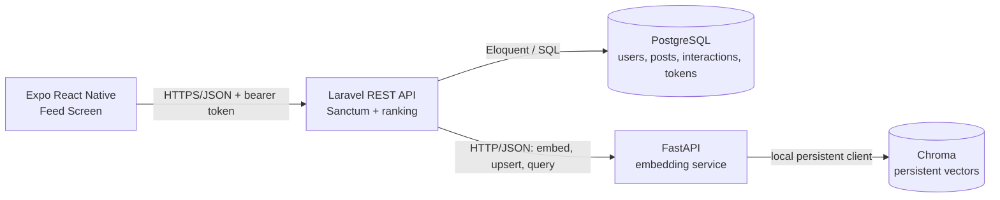

# Technical Solution Document

## 1. Executive Summary

This assessment implements a deliberately small monorepo with three application processes: an Expo React Native feed screen, a Laravel REST API, and a Python FastAPI embedding service. Laravel owns authentication and relational data in PostgreSQL. The Python service owns embedding generation and persistent vector storage in Chroma. The API supports post creation, a personalized paginated feed, natural-language search, and interaction logging without introducing infrastructure that the assignment does not require.

Authenticity is an explainable text-based approximation. The available input contains post text and an optional image URL, so the system does not claim to detect visual filters, retouching, or image polish. Production-grade visual authenticity would require image metadata, direct image access, or a vision model.

## 2. Product Understanding

The product is a focused proof of concept for ranking a social feed around authentic expression and meaningful relationships while supporting semantic discovery. The API can create a text post with an optional remote image URL; the single mobile screen browses the ranked feed, searches posts by meaning rather than exact keywords, and records reaction events. The API also accepts view and reply interaction events for preference signals.

The assessment tests system design, ranking choices, API quality, data modeling, SQL fluency, a single mobile feed experience, and reproducible local setup. It is not a complete social network.

## 3. Goals and Non-Goals

### Goals

- Provide the four required authenticated API endpoints.
- Persist users, posts, interactions, and Sanctum tokens in PostgreSQL.
- Generate post and query embeddings through FastAPI and persist vectors in Chroma.
- Rank feeds using authenticity, relationship depth, semantic relevance, and time decay.
- Render one Expo React Native TypeScript feed screen.
- Provide four raw PostgreSQL challenge queries and reproducible local instructions.
- Keep decisions explainable and the local system easy to run.

### Non-Goals

- Image upload, image processing, or claims of visual authenticity detection.
- Follow/social-graph modules, comments/replies content, messaging, notifications, or additional mobile screens.
- Admin panels, recommendation-model training, moderation workflows, or production analytics.
- Redis, queues, WebSockets, event sourcing, Kubernetes, Docker, cloud infrastructure, or additional microservices.

## 4. Assumptions

- All API endpoints require a valid local Sanctum bearer token.
- Seeders create three demo users; a documented local-only command issues tokens, so no login screen or authentication endpoint is needed.
- An interaction of type `reply` records that a reply occurred; reply body storage is outside scope.
- `image_url` is a reference to an already-hosted image, not an upload.
- Post text is the only content embedded by the implemented service.
- Chroma runs persistently inside the Python service process using a local data directory; it is not a fourth network service.
- Feed candidates exclude the requesting user's own posts and use a bounded recent candidate set so ranking remains understandable for the take-home.
- All timestamps are stored in UTC and returned as ISO 8601 strings.

## 5. Monorepo Structure

```text
guised-up-assessment-vipul-walia/
├── apps/
│   ├── api/                    # Laravel API, migrations, seeders, and tests
│   └── mobile/                 # Expo React Native TypeScript feed screen
├── services/
│   └── embeddings/             # FastAPI service, Chroma persistence, and tests
├── docs/
│   └── TSD.md                  # This document
├── sql/
│   └── queries.sql             # Four PostgreSQL challenge queries
└── README.md
```

## 6. System Architecture



Laravel is the public application boundary and source of truth for post and interaction records. The Python service has one responsibility: embedding and vector operations. Chroma stores vector documents keyed to PostgreSQL post IDs; it does not replace relational storage.

## 7. Request and Data Flows

### Post creation and embedding

1. An authenticated API consumer sends `POST /api/posts` with `text` and optional `image_url`; post creation UI is outside the single mobile screen's scope.
2. Laravel validates the request, calculates the text-based authenticity score, and inserts the post with `embedding_status = pending`.
3. After the database insert commits, Laravel synchronously asks FastAPI to embed the text and upsert the vector under `post-{id}` with `post_id` metadata.
4. Laravel stores that identifier in `vector_document_id` and marks the post `ready`.
5. If embedding fails or times out, the post remains usable with `embedding_status = failed`; the API returns the created post honestly rather than pretending semantic indexing succeeded. The `app:index-posts` command can retry it locally.

### Personalized feed retrieval

1. The client requests authenticated `GET /api/feed?page=N`.
2. Laravel loads a bounded set of recent posts and interaction aggregates from PostgreSQL.
3. When the user has interaction history, Laravel selects relevant seed post IDs and asks FastAPI for recommendations based on their averaged embeddings.
4. Laravel normalizes the four ranking signals, computes one score per candidate, sorts by score and then recency, and paginates the ranked result at 20 posts per page.
5. If vector ranking is unavailable, Laravel sets semantic relevance to zero, marks `semantic_ranking_available` false, and returns a valid feed using the same documented weights.

### Semantic search

1. The client sends authenticated `GET /api/search?q={query}`.
2. Laravel validates and forwards the query to FastAPI.
3. FastAPI embeds the query, asks Chroma for nearest post vectors, and returns IDs with cosine similarity.
4. Laravel fetches the corresponding PostgreSQL posts, preserves relevance order, excludes unavailable records, and returns at most 10 results.
5. If the embedding service is unavailable, Laravel returns `503` with the shared error shape; lexical search is not silently substituted for semantic search.

### Interaction logging

1. The client sends authenticated `POST /api/interactions` with `post_id` and `type`.
2. Laravel validates the type and target post, then inserts an interaction owned by the authenticated user.
3. The new row contributes to later relationship and interest-vector calculations. Repeated views are allowed because they represent separate events.

### Implemented mobile screen

Phase 6 implements one `FlatList`-based Expo screen. A small typed `fetch` client owns environment validation, bearer headers, safe JSON parsing, and Laravel error extraction. `FeedScreen` owns the loaded feed, pagination metadata, debounced abortable search, refresh, and session-only reaction state; `PostCard` owns presentation and image-failure state. The client calls only feed, search, and interaction endpoints because post creation and authentication screens are outside the assignment's mobile scope.

Feed pagination follows `meta.has_more_pages`, permits only one next-page request at a time, retries a failed page without discarding loaded posts, and appends unique IDs in backend order. Pull-to-refresh replaces the feed with page one and keeps reacted IDs. A trimmed non-empty query switches the same list area into search mode after a 350 ms debounce, aborts stale requests, preserves Laravel's semantic order, and disables feed pagination and refresh until cleared.

The screen architecture matches the intended single-screen design. The only testing-strategy deviation is using focused Jest unit coverage for the API boundary and relative-time utility without React Native Testing Library; this avoids adding a component-test library solely for the assessment while the required TypeScript and native Expo export gates validate the composed screen.

## 8. Database Schema

PostgreSQL is authoritative for application data. IDs use auto-incrementing `bigint` columns and foreign keys enforce ownership. Laravel treats application timestamps as UTC and serializes them as ISO 8601, while the current PostgreSQL migrations use nullable `timestamp(0) without time zone` columns.

### `users`

| Field | Type | Rules |
|---|---|---|
| `id` | `bigint` | Primary key |
| `name` | `varchar(255)` | Required |
| `email` | `varchar(255)` | Required, unique |
| `email_verified_at` | `timestamp(0) without time zone` | Nullable |
| `password` | `varchar(255)` | Required, hashed; seeded locally |
| `created_at`, `updated_at` | `timestamp(0) without time zone` | Nullable at the schema level; written by Eloquent |

### `posts`

| Field | Type | Rules |
|---|---|---|
| `id` | `bigint` | Primary key |
| `user_id` | `bigint` | FK to `users.id`, cascade on delete |
| `text` | `text` | Required, non-blank, maximum 5,000 characters at API boundary |
| `image_url` | `varchar(2048)` | Nullable; API accepts only HTTP(S) URLs up to 2,048 characters |
| `authenticity_score` | `numeric(5,4)` | Required, default `0`; application values remain between `0` and `1` |
| `vector_document_id` | `varchar(255)` | Nullable, unique when present |
| `embedding_status` | `varchar(255)` | Required, default `pending`; expected application values are `pending`, `ready`, `failed` |
| `embedding_error` | `text` | Nullable indexing failure detail |
| `created_at`, `updated_at` | `timestamp(0) without time zone` | Nullable at the schema level; written by Eloquent in UTC |

Indexes: `(user_id, created_at)` for author post queries, `created_at` for recent feed candidates, and `embedding_status` for the indexing command. `vector_document_id` has a nullable unique index.

### `interactions`

| Field | Type | Rules |
|---|---|---|
| `id` | `bigint` | Primary key |
| `user_id` | `bigint` | FK to `users.id`, cascade on delete |
| `post_id` | `bigint` | FK to `posts.id`, cascade on delete |
| `type` | `varchar(255)` | Expected application values are `view`, `reaction`, `reply` |
| `created_at`, `updated_at` | `timestamp(0) without time zone` | Nullable at the schema level; written by Eloquent in UTC |

Indexes: `(user_id, created_at)` for user-interest history; `(post_id, type)` for interaction aggregation; `(user_id, post_id, created_at)` for event history; and `(type, created_at)` for type-specific recency queries. No uniqueness constraint is added because repeated events, especially views, are meaningful. Allowed status/type checks remain at the application boundary so the migrations remain portable to Laravel's normal test environment.

### `personal_access_tokens`

Laravel Sanctum's standard polymorphic token table is used: `id`, `tokenable_type`, `tokenable_id`, `name`, unique hashed `token`, nullable `abilities`, nullable `last_used_at`, nullable `expires_at`, and timestamps. The `(tokenable_type, tokenable_id)` index supports token ownership lookups; the unique token index supports authentication.

### Relationships

- A user has many posts and interactions.
- A post belongs to one author and has many interactions.
- A user has many Sanctum personal access tokens through the polymorphic token relation.

A separate follows system is unnecessary because relationship depth can be inferred from the requesting user's weighted interactions with each post author. This directly serves the required ranking signal without expanding the assessment into social-graph management.

### SQL challenge

[`sql/queries.sql`](../sql/queries.sql) contains the four PostgreSQL answers: recent active actors, recent posts from an input user's strongest interaction relationships, high-view zero-reaction posts, and potential-spam authors. They use the existing user, post, interaction-type/date, actor/date, post/type, and author/date indexes without schema changes. D2 intentionally counts each interaction event equally, unlike the weighted feed relationship signal.

## 9. Vector Embedding Design

### Why Chroma

Chroma provides persistent local vector storage, metadata filtering, and nearest-neighbor queries with little operational overhead. It suits a reproducible take-home better than adding vector extensions or managed infrastructure, while keeping vector concerns isolated in Python.

### Post storage and query embedding

The service runs on the tested Python 3.14.4 environment and normally uses `sentence-transformers/all-MiniLM-L6-v2` on CPU for both posts and queries. The model loads once, lazily, and produces normalized vectors. FastAPI upserts one persistent Chroma cosine collection named `posts` under `services/embeddings/storage/chroma/`. Each document uses a deterministic caller-supplied ID such as `post-15`, the original post text, and optional string, integer, float, or boolean metadata. Repeating an ID replaces that Chroma document rather than duplicating it.

`POST /documents/upsert` embeds and stores a document. `POST /search` embeds a non-empty natural-language query, supports limits from 1 to 50 and explicit ID exclusions, and returns document IDs, scalar metadata, and higher-is-better scores mapped from cosine similarity into `[0, 1]`. Empty collections return an empty result set. PostgreSQL content is not fabricated or returned by this service.

### Seed recommendations and user-interest integration

`POST /recommendations` accepts one or more seed document IDs, ignores missing IDs when at least one valid seed remains, averages and L2-normalizes the valid stored vectors, and queries the same collection. Seed IDs and explicit exclusions are omitted from the response. If no seed exists, the service returns a clear not-found error. Laravel selects up to 20 recent unique vector-ready posts from the authenticated user's interactions; this endpoint supplies only the vector-similarity component and does not invent relational interaction data.

### Failure and fallback behavior

- `sentence_transformer` is the normal provider. If its configured model cannot load or embed, the operation fails clearly; the process never silently changes algorithms.
- `hash` is an explicit deterministic provider for tests and constrained local environments. It uses stable signed token hashing and normalized vectors, provides lexical similarity only, and is not true semantic understanding.
- Post creation succeeds relationally even when indexing fails, and exposes `embedding_status = failed`.
- Feed ranking sets semantic relevance to zero when FastAPI or Chroma is unavailable and reports that degradation in response metadata.
- Search returns `503 Service Unavailable` because returning lexical results would misrepresent the required semantic behavior.
- Chroma results whose posts no longer exist in PostgreSQL are ignored.
- Timeouts are short and explicit; errors are logged without exposing internals to the client.

## 10. API Design

### Authentication strategy

Every endpoint uses `auth:sanctum` and accepts `Authorization: Bearer <local-token>`. Seeders create three local users. The local-only `app:issue-demo-token` command creates tokens for simulator testing. No login endpoint or mobile login screen is added.

Successful responses from the four assignment endpoints use a `data` key. Validation and service errors share a predictable error shape; the auxiliary `/api/user` route returns Laravel's authenticated user representation directly.

### `POST /api/posts`

Request:

```json
{
  "text": "I finally learned to make my grandmother's soup today.",
  "image_url": "https://example.test/images/soup.jpg"
}
```

Validation: `text` is required, a string, non-blank, and at most 5,000 characters. `image_url` is nullable, an HTTP(S) URL, and at most 2,048 characters.

Response: `201 Created`.

```json
{
  "data": {
    "id": 42,
    "user": { "id": 1, "name": "Vipul Demo" },
    "text": "I finally learned to make my grandmother's soup today.",
    "image_url": "https://example.test/images/soup.jpg",
    "authenticity_score": 0.84,
    "embedding_status": "ready",
    "created_at": "2026-07-13T10:30:00Z",
    "updated_at": "2026-07-13T10:30:00Z"
  }
}
```

### `GET /api/feed?page=1`

Validation: `page` is optional and must be an integer of at least `1`. Page size is fixed at `20`.

Response: `200 OK`.

```json
{
  "data": [
    {
      "id": 42,
      "user": { "id": 2, "name": "Asha" },
      "text": "A quiet morning walk before work.",
      "image_url": null,
      "authenticity_score": 0.74,
      "embedding_status": "ready",
      "created_at": "2026-07-13T08:00:00Z",
      "updated_at": "2026-07-13T08:00:00Z",
      "ranking": {
        "score": 0.82,
        "authenticity": 0.74,
        "relationship_depth": 1.0,
        "semantic_similarity": 0.81,
        "time_decay": 0.69
      }
    }
  ],
  "meta": {
    "current_page": 1,
    "per_page": 20,
    "total": 47,
    "last_page": 3,
    "has_more_pages": true,
    "semantic_ranking_available": true
  }
}
```

### `GET /api/search?q=quiet moments outdoors`

Validation: `q` is required, a non-blank string, and at most 500 characters. The result limit is fixed at `10`.

Response: `200 OK`; each result has the normal post representation plus `semantic_similarity` from `0` to `1`.

```json
{
  "data": [
    {
      "id": 42,
      "user": { "id": 2, "name": "Asha" },
      "text": "A quiet morning walk before work.",
      "image_url": null,
      "authenticity_score": 0.74,
      "embedding_status": "ready",
      "created_at": "2026-07-13T08:00:00Z",
      "updated_at": "2026-07-13T08:00:00Z",
      "semantic_similarity": 0.91
    }
  ]
}
```

### `POST /api/interactions`

Request:

```json
{
  "post_id": 42,
  "type": "reaction"
}
```

Validation: `post_id` is required and must reference an existing post; `type` is required and one of `view`, `reaction`, or `reply`.

Response: `201 Created`.

```json
{
  "data": {
    "id": 173,
    "user_id": 1,
    "post_id": 42,
    "type": "reaction",
    "created_at": "2026-07-13T10:35:00Z"
  }
}
```

### Status codes and errors

- `200` for successful reads.
- `201` for created posts and interactions.
- `401` for missing or invalid tokens.
- `404` for unavailable resources where applicable.
- `422` for validation failures.
- `503` when semantic search cannot reach its required vector capability.

```json
{
  "message": "The selected type is invalid.",
  "errors": {
    "type": ["The selected type is invalid."]
  }
}
```

Non-validation failures use a sanitized top-level `message` and never expose a stack trace or upstream response body.

Post creation is a deliberate partial-failure boundary: PostgreSQL creation still returns `201` when semantic indexing fails. The post is returned with `embedding_status: "failed"` and a sanitized retry warning; upstream bodies, vector data, and `embedding_error` are not exposed.

## 11. Feed Ranking Algorithm

### Plain-English approach

The feed favors posts that look conversational and personal based on available text, authors with whom the user has meaningfully interacted, posts semantically close to the user's demonstrated interests, and recent posts. No signal is allowed to use a radically different numerical range. The score is explainable and deterministic, which is more appropriate here than an opaque learned model.

### Normalized signals

- `A`, authenticity: stored directly in `[0,1]`. Start from a neutral base and reward first-person/conversational language and reasonable lexical diversity; penalize excessive hashtags, URLs, repeated characters, all-caps text, and promotional phrasing. It is not a visual-quality score.
- `R`, relationship depth: sum weighted interactions by the current user across posts from each candidate author, then divide each author total by that user's strongest author total. Authors without history receive `0`.
- `S`, semantic relevance: use FastAPI's already-normalized higher-is-better similarity in `[0,1]`, then clamp.
- `T`, time decay: `exp(-age_hours / 72)`, with future timestamps clamped to age zero so the value remains in `(0,1]`.

Interaction weights are `view = 1`, `reaction = 3`, and `reply = 5`. Replies indicate more investment than reactions, while views are useful but weak.

### Weighted score

```text
score = 0.25A + 0.30R + 0.30S + 0.15T
```

If semantic ranking is unavailable or no valid seed exists, set `S = 0` without changing the exact weights. Scores tie-break by `created_at DESC`, then `id DESC`.

### New users

For a user with no interactions, `R = 0` and no interest vector exists. The feed uses authenticity and time decay with the same exact weights, providing a useful recent feed without inventing preferences. As interactions accumulate, relationship and semantic signals enter naturally.

### Pseudocode

```text
function personalizedFeed(user, page):
    candidates = recentPosts(excludingAuthor=user.id, boundedLimit=500)
    history = interactionsFor(user.id)
    authorWeights = aggregateByPostAuthor(history, view=1, reaction=3, reply=5)
    seedDocuments = recentUniqueVectorReadyPosts(history, limit=20)

    semanticScores = {}
    if seedDocuments exist and embeddingService is available:
        semanticScores = recommendations(seedDocuments, candidates)

    ranked = []
    for post in candidates:
        A = clamp(post.authenticityScore, 0, 1)
        R = authorWeights[post.userId] / max(authorWeights)
        S = clamp(semanticScores[post.id] ?? 0, 0, 1)
        T = exp(-max(0, ageInHours(post.createdAt)) / 72)
        score = 0.25*A + 0.30*R + 0.30*S + 0.15*T

        ranked.append(post, score)

    sort ranked by score DESC, createdAt DESC, id DESC
    return paginateInMemory(ranked, page, perPage=20)
```

The bounded candidate set is an assessment trade-off. At production scale, candidate generation and ranking would move closer to indexed/vector queries rather than loading hundreds of records into application memory.

## 12. Natural-Language Search Design

Search treats the submitted sentence as semantic intent, not a set of exact terms. Laravel validates `q`, FastAPI generates an embedding with the same model used for posts, and Chroma returns nearest vectors by cosine distance. FastAPI converts distance into a documented normalized similarity, and Laravel joins vector IDs back to authoritative post records before returning the top 10.

The endpoint does not blend popularity or relationship signals because the requirement is relevance-focused semantic search. Empty queries are rejected, missing relational posts are skipped, and embedding-service failure produces a transparent `503` rather than a misleading substitute.

## 12.1 Existing-post indexing

`php artisan app:index-posts` synchronously processes pending and failed PostgreSQL posts; `--force` processes all posts. Each successful record uses `post-{id}`, becomes ready, and clears its prior sanitized error. Individual failures are marked failed without stopping later records, totals are printed without post text, and any failure produces a non-zero exit status.

## 13. Security and Authentication

- Laravel Sanctum tokens are hashed in PostgreSQL and sent only through bearer authorization headers.
- Local tokens are development credentials, excluded from source control, and generated through seed output or a local-only command.
- Route middleware derives `user_id`; clients cannot submit another user's ID.
- Laravel validation bounds strings, restricts interaction types, validates foreign keys, and accepts only HTTP(S) image URLs.
- Eloquent/query bindings prevent SQL injection; the SQL challenge uses a one-row typed parameter CTE for its input user ID.
- FastAPI is bound for local development and is not exposed to the mobile app. Laravel uses a configured base URL and short timeout.
- API errors omit stack traces, secrets, model paths, and internal service responses.
- Repository visibility is intentionally public for direct recruiter access. The original assessment PDF, secrets, access tokens, credentials, generated data, and local environment files are excluded. Public visibility was a deliberate submission choice made by the candidate.

## 14. Testing Strategy

Laravel uses PHPUnit feature and unit tests, the Python service uses `pytest`, and the mobile project uses focused Jest tests for its API boundary and relative-time utility. TypeScript and native Expo exports validate the composed mobile screen without adding a component-test framework solely for this assessment.

Critical tests include:

1. **Post creation integration:** authenticated valid input creates the relational post, calculates a bounded authenticity score, calls the embedding service, and stores the returned vector ID; a service failure leaves an honest `failed` status without losing the post.
2. **Feed ranking unit test:** fixed posts and interaction history produce deterministic normalized scores, respect interaction weights and time decay, paginate exactly 20 per page, and use the documented tie-breakers.
3. **New-user/fallback feed test:** no interaction history and an unavailable embedding service still return an authenticity-and-recency feed without fabricated semantic scores.
4. **Semantic search feature test:** a query returns at most 10 posts in vector relevance order and returns the documented `503` when FastAPI is unavailable.
5. **Authorization and validation tests:** unauthenticated requests return `401`; invalid post, query, interaction type, URL, and missing post IDs return `422` without persistence.
6. **Embedding service tests:** temporary Chroma storage and the explicit deterministic hash provider verify health reporting, idempotent upserts, related-content search ordering, seed recommendations, exclusions, scalar metadata validation, and missing-seed errors without model downloads or network access.
7. **Mobile client tests:** request tests verify base-URL normalization, bearer headers, the exact reaction payload, authentication sanitization, and malformed success handling; relative-time tests cover minutes, hours, days, weeks, invalid values, and future values.
8. **SQL correctness checks:** each D1-D4 query executes on PostgreSQL, with rollback-only validation data covering aggregate separation, limits, author frequency, time windows, zero reactions, and strict post-count thresholds.

## 15. Local Development Strategy

PostgreSQL must be running locally and the Laravel/Python environment variables must point to writable local storage. Chroma persists under `services/embeddings/storage/chroma/` (ignored by Git) and is opened by FastAPI rather than run separately.

The three application processes are:

1. **Laravel API:** run portably through `php artisan serve` from `apps/api`. Migrations and seeders prepare PostgreSQL; `app:issue-demo-token` provides a local Sanctum token.
2. **Embedding service:** use Python 3.14.4 to create a virtual environment under `services/embeddings`, install the pinned requirements, copy `.env.example` to `.env`, and run FastAPI with Uvicorn. It lazily loads `sentence-transformers/all-MiniLM-L6-v2` once and uses local persistent Chroma storage.
3. **Expo mobile app:** copy `.env.example` to `.env`, set a reachable `EXPO_PUBLIC_API_BASE_URL` and locally issued `EXPO_PUBLIC_API_TOKEN`, run `npm start` from `apps/mobile`, and open the app in an iOS/Android simulator or Expo Go. Use loopback for iOS, `10.0.2.2` for the Android emulator, or the development machine's LAN IP for a physical device. The `EXPO_PUBLIC_*` token is bundled and is acceptable only for this local assessment demonstration.

The root [README](../README.md) contains the complete fresh-clone setup, service order, networking options, token workflow, and validation commands.

## 16. Trade-offs and Limitations

- Authenticity is an explainable text heuristic, not a truth detector. It can be gamed and cannot assess visual filters or polish from an optional URL.
- Synchronous indexing keeps the architecture reproducible but adds latency to post creation and requires explicit partial-failure handling.
- PostgreSQL and Chroma can temporarily diverge because there is no cross-store transaction; deterministic IDs and reconciliation reduce the risk.
- On-demand seed-vector aggregation and in-memory Laravel ranking suit assessment data volumes, not a large feed corpus.
- Interaction-derived relationship depth avoids a follows module but cannot represent relationships before users interact.
- Repeated interaction rows improve signal fidelity but require aggregation and can be noisy; caps limit abuse in ranking.
- Offset pagination over a changing ranked feed can shift results between requests. It is accepted for the required small API and fixed 20-item pages.
- One configured embedding model per collection keeps vectors compatible locally but requires explicit versioning and re-indexing when changed.

## 17. Production Evolution

Production evolution would add asynchronous durable indexing, model and collection versioning, vector/database reconciliation, richer observability, abuse controls, cached or incrementally updated interest profiles, and scalable candidate generation. Visual authenticity could be explored only with user consent, image access, metadata, and a validated vision approach. These are future considerations, not assessment implementation scope.

## 18. AI-Assisted Workflow

Laravel and PHP are the candidate's primary areas of professional expertise. Python/FastAPI and React Native/Expo are areas of working familiarity rather than claimed specialist expertise.

AI-assisted development is disclosed as part of the implementation workflow:

- ChatGPT supported assignment analysis, technical clarification, decomposition into focused phases, and prompt preparation.
- OpenAI Codex Goal Mode inspected, implemented, validated, and documented the repository across eight primary phases.
- Additional correction prompts were used when formatting, documentation, or scope required adjustment.
- The candidate reviewed every phase before continuing and remained responsible for architecture and product decisions, scope, corrections, validation, and final submission.
- Generated output was verified through automated tests and live smoke tests rather than trusted without review.

The workflow does not claim that every line was typed manually, that the repository was produced autonomously, or that AI made decisions without candidate direction and review.

### Running log

| Date | Tool | Phase | Work performed | Human review |
|---|---|---|---|---|
| 2026-07-13 | ChatGPT | Planning | Analyzed the assignment and organized work into phases. | Requirements carried into the Phase 1 contract. |
| 2026-07-13 | OpenAI Codex Goal Mode | Phase 1 | Authored the TSD and minimal README; no application code was scaffolded. | Reviewed during the phased handoff and the final Phase 8 audit. |
| 2026-07-13 | OpenAI Codex Goal Mode | Phase 2 | Inspected the repository and local toolchain; scaffolded the Laravel API, Expo TypeScript app, and FastAPI service; established the minimal monorepo structure. | Framework startup and static validation completed. |
| 2026-07-13 | OpenAI Codex Goal Mode | Phase 3 | Added the PostgreSQL post/interaction schema, Eloquent relationships, factories, deterministic demo data, and a local Sanctum token command; validated migrations, relational integrity, and bearer authentication against `guised_up`. | PHPUnit, Composer validation, route inspection, and a live authenticated request completed. |
| 2026-07-13 | OpenAI Codex Goal Mode | Phase 4 | Implemented the internal FastAPI embedding boundary, explicit transformer and hash providers, persistent cosine Chroma storage, idempotent upserts, search, seed recommendations, validation, and isolated tests. | Python 3.14 dependency imports, pytest, live hash requests, and live `all-MiniLM-L6-v2` semantic ranking were validated; both servers were stopped. |
| 2026-07-13 | OpenAI Codex Goal Mode | Phase 5 | Implemented the four Sanctum endpoints, deterministic authenticity scoring, personalized feed ranking, Laravel FastAPI integration, existing-post indexing, and focused feature/unit tests. Corrected the ranking normalization and decay lines to match the Phase 5 contract. | PHPUnit and Laravel contract validation completed; the real transformer-backed local smoke test is recorded in the Phase 5 delivery report. |
| 2026-07-13 | OpenAI Codex Goal Mode | Phase 6 | Implemented the single Expo Feed Screen, strict typed API client, page-based infinite scroll, pull-to-refresh, debounced abortable natural-language search, session-only reaction logging, and intentional inline states. | TypeScript, Jest, Expo public config, Android/iOS exports, and contract/scope checks completed. |
| 2026-07-13 | OpenAI Codex Goal Mode | Phase 7 | Implemented and transaction-validated the four PostgreSQL challenge queries, finalized the root setup guide, reviewed the complete TSD against the delivered repository, and documented the intentional public submission choice. | Cross-project tests, SQL rollback checks, links, commands, environment examples, scope, and security were reviewed. |
| 2026-07-13 | OpenAI Codex Goal Mode | Phase 8 | Completed the final requirement audit, cross-project validation, transformer-backed end-to-end smoke test, public-repository security review, video walkthrough preparation, and final Git submission preparation. | Verified Laravel, Python, mobile exports, SQL, deterministic restored data, documentation accuracy, secret exclusions, and clean process shutdown before submission. |

## 19. Implementation Sequence

1. **Phase 1:** define and review the TSD and minimal README.
2. **Phase 2:** scaffold the Laravel, Expo, and FastAPI applications.
3. **Phase 3:** implement PostgreSQL models, deterministic seed data, Sanctum, and local token generation.
4. **Phase 4:** implement and test the FastAPI/Chroma embedding boundary.
5. **Phase 5:** implement the authenticated API, authenticity heuristic, feed ranking, semantic search, interaction logging, and indexing command.
6. **Phase 6:** implement and validate the single Expo Feed Screen.
7. **Phase 7:** implement and validate D1-D4, finalize local setup, and complete the TSD review.
8. **Phase 8:** audit the final submission, rerun every project gate and the live integration flow, prepare the recording guide, and verify the public Git submission.

Each phase was kept reviewable without pulling production-evolution ideas into assessment scope.

## 20. Acceptance Checklist

### Historical Phase 1 documentation checkpoint

- [x] TSD contains all 20 required sections and the Mermaid architecture diagram.
- [x] Architecture contains only Expo mobile, Laravel API, PostgreSQL, FastAPI, and Chroma.
- [x] Data flows cover post creation, feed retrieval, search, and interaction logging.
- [x] Schema documents fields, constraints, relationships, and relevant PostgreSQL indexes.
- [x] Ranking defines normalized authenticity, relationship, semantic, and decay signals with pseudocode and new-user behavior.
- [x] API examples, validation, status codes, pagination, security, testing, local processes, trade-offs, AI usage, and implementation order are documented.
- [x] Authenticity is explicitly limited to available text signals; no visual detection is claimed.
- [x] The Phase 1 README reflected the then-current documentation-only implementation state; repository visibility was clarified later as an intentional public submission choice.
- [x] Phase 1 added no application code, dependencies, SQL challenge file, confidential PDF, commit, or push.

### Later implementation

- [x] Laravel API and PostgreSQL schema are implemented and tested.
- [x] FastAPI and persistent Chroma integration are implemented and tested.
- [x] The four authenticated API endpoints meet their contracts.
- [x] The Expo TypeScript feed screen is implemented and tested.
- [x] Raw SQL challenge queries are added and transaction-validated on PostgreSQL.
- [x] Reproducible setup commands and final quality-gate commands are documented.
- [x] The video walkthrough recording guide is prepared without claiming the video is recorded or uploaded.
- [x] The final TSD matches the implemented schema, services, API contracts, ranking, mobile scope, and AI-assisted workflow.
